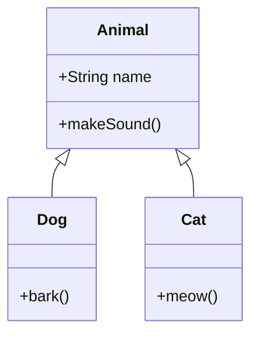
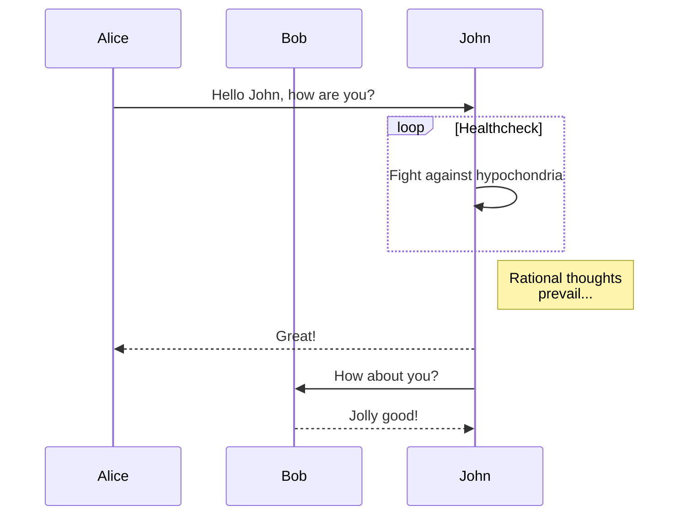
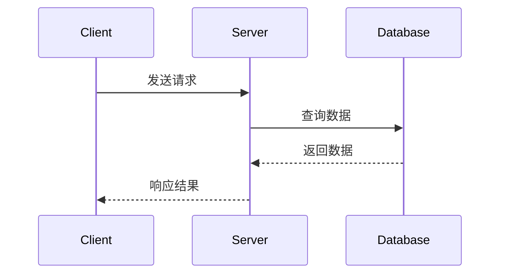

# 示例文章

这是一篇示例文章，展示了极简主题的文章样式。

## 小标题

你可以在这里写一些内容。

### 代码示例

```python
def hello_world():
    print("Hello, World!")
```

## 列表示例

- 项目 1
- 项目 2
- 项目 3

## 引用示例

### MerMaide支持测试

这是一个类图示例：



或者序列图：





> 这是一段引用文字。
> 可以写多行。 